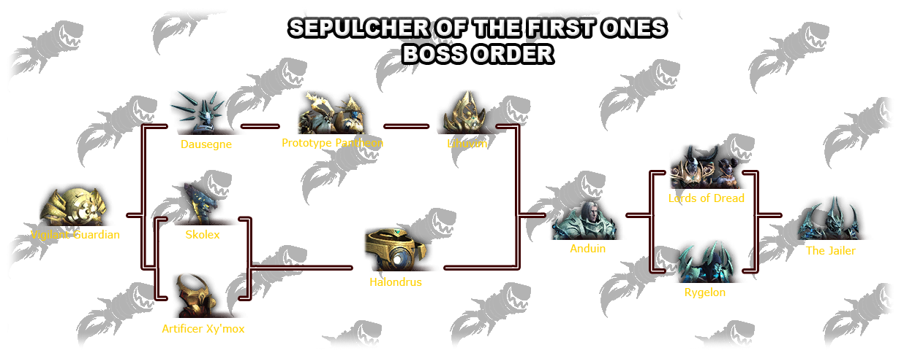

# Sepulcher of the First Ones

Sepulcher is the season 3 Shadowlands raid releasing Normal/Heroic up to Anduin on 3/1/22 and mythic/final three bosses releasing on 3/8/22 with the start to Race to World First!! [Overview on Wowhead][1] will likely be updated throughout progression. This document is intended to be a RL resource for those entering Sepulcher on Normal or Heroic difficulties.

Boss order is depicted in the following Wowhead image:

Jump to Boss:
- [Vigilant Guardian](#vigilant-guardian)
- [Skolex](#skolex)
- [Artificer Xy'mox](#artificer-xymox)
- [Dausegne](#dausegne)
- [Prototype Pantheon](#prototype-pantheon)
- [Lihuvim](#lihuvim)
- [Holandrus](#holandrus)
- [Anduin Wrynn](#anduin-wrynn)
- [Lords of Dread](#lords-of-dread)
- [Rygelon](#rygelon)
- [Zovaal](#zovaal)

Boss notes initially populated with recap of guides over at [Ready Check Pull][2], which are great resources for quick overviews of each fight. Also, [MythicTrap][3] is an amazing resource that is heavily used in the later bosses of this guide.

##  Vigilant Guardian

### Phase One

- kill regular adds to activate big adds (believe x3)
- use the shield from the big adds during Exposed Core (boss 100% energy)
- use the orbs that drop from the big adds on the boss to activate him
- phase over when all orbs are delivered and boss at 60%

### Phase Two

- tanks fae the boss away and taunt swap at 50% energy
- players with the Matter Dissolution debuff need to get away from the raid, wait for the debuff to expire, then dodge orbs on your way back to the raid

### Phase Three

- lust and kill the boss before the ramping damage gets too crazy
- healers might wnat to save cooldowns for this phase

##  Skolex

### Pre-pull

- set up 2 markers, one directly under the boss and another marker 30 yards away
- designate 2 groups of 3 ranged players to be the farthest away from the raid (likely mobile ranged to avoid conal)

### Throughout the Fight

- everyone gains stacks of the Ephemeral Dust debuff
- the three farthest ranged players gain extra stacks
- to remove the stacks, **everyone** in the raid needs to stack tightly 30 yards away from the boss on the assigned marker (tanks and healers included)
- tanks stay stacked up until 100 energy and then spread for the tank combo
- melee dodge swirlies
- at 100 energy, tanks never take two hits of Riftmaw or Rend in a row and use a big damage reduction ability to survive

### Fight Flow

- tank combo, dodge frontal, tank combo again, dodge frontal again and move to stack on the marker for debuff removal

##  Artificer Xy'mox

### Pre-pull

- set markers for portal locations (center just off-center, tank at perim)
- consider setting marker for trap dropoff (can't remove on heroic)

### Phase One

- two players will get marked to drop the portals. One portal will go to the center (random non-tank) and one will go the the edge of the platform (tank)
- rings will expand from or contract to the middle of the platform. Getting hit by a ring will kill you so use the portals to teleport to safety
- an additional ring will spawn when the boss gets to 75% and 50% health
- when the tank gets Glyph of Relocation, the raid should run away from the tank while the tank runs to the appropriate portal. When it expires, the raid will be pulled on the tank
- try and put traps toward one side so that there's a clean area in the third p1

### Phase Two

- tanks need to pick up the adds, having one Xy Acolyte each
- nuke the Xy Acolytes as fast as possible because at 100 energy they wipe the raid
- interrupt the Xy Spellsingers

### Fight Flow

- 100% Phase One (Ring)
- 75% Adds - Phase Two (Ring x2)
- 50% Adds - Phase Three (Ring x3)

##  Dausegne

### Pre-pull

- consider marking each of the four "reservoirs" for easier positioning calls

### Throughout the Fight

- a **Domination Core** add regularly spawns that needs to be interrupted and cleaved down as fast as possible because it shoots pools on the ground that suck
- help the marked player split the damage of **Staggering Barrage** by standing in between the orbs and the marked player. On Heroic, never soak two orb casts in a row
- **tanks**, taunt swap whenever the previous debuff expires
- when the boss gets to zero mana, she'll shield herself and cast **Inevitable Dominion**, doing a ton of damage to the entire raid. The raid needs to stak up and break the shield as fast as possible. **Healers** need to manage healer cooldowns during this
- at the start of the fight, and after every **Inevitable Dominion** an additional halo ring will expand from one of the 4 reservoirs, 4 rings total at the end. Pass through one ring as soon as possible and let your debuff expire before passing through the next. Never pass through a ring with the debuff active

##  Prototype Pantheon

### Phase One: War (Necrolord) and Duty (Kyrian)

- kill the adds that spawn around the room before the green pool covers the entire platform
- designate a few players to interrupt Gloombolt (War) as often as possible
- several players will get the Runecarver's Deathtouch debuff. They need to run to the white Bastion bubble and call to get dispelled
- keep the bosses stacked when Duty flies in the air and dodge swirlies
- tanks, taunt swap Duty when the Humbling Strikes debuff falls off
- try to get the bosses to 50% HP at the same time. Phase ends when first of the two bosses reaches 50%

### Phase Two: Renewal (Night Fae) and Absolution (Venthyr)

- tank towards middle, dodge a bunch of stuff
- interrupt Anima Bolt (Renewal) whenever possible
- healers, seeds spawn that need to be healed to full 20 seconds apart from each other to gain a big heal and a stacking healing buff on the raid. If they die they do a ton of bad stuff to the raid so do not let the seeds die
- when the boss pulls the raid in, run away and spread out to avoid the bolts that shoot from the player (like prideful)
- tanks, point Absolution away from the raid and taunt swap when Wracking Pain falls off
- try to get the bosses to 50% P at the same time. Phase also ends when first boss add reaches 50%

### Phase Three: All Four Bosses

- you'll be dealing with all four boss abilities in this phase
- remember to interrupt both Renewal and War
- tanks need to taunt swap on Duty and Absolution
- can aim Absolution's Wracking Pain at Necrotic Ritualist adds to damage them
- when the boss does the Hand of Destruction pull, use healing cooldowns and movement speed increases
- all the bosses need to die within 20 seconds of each other

##  Lihuvim

### Boss Phase

- tank boss clockwise at a moderate radius around room, facing outwards
- several players will be targeted with a circle. They need to tightly stack, counter clockwise behind the raid. When the debuffs expire a bunch of motes will spawn. If you touch them, they will turn into a permanent pool
- if you get marked with an arrow, run right next to any untriggered motes and wait for the debuff to expire to clear the motes
- position yourself so that when the boss does its knockback, you wont get knocked into any motes
- tanks, fae the boss away from the raid and use a personal when he casts Protoform Cascade
- on heroic, the taunt swap for the tanks is Resonance, which is three casts of two abilities. Tank 1 will take the Kinetic Resonance smash, Tank 2 will take the Sundering Resonance

### Add Phase

- at 100 energy, the boss will spawn several adds in the corners of the room
- Normal kill order: Acquisitions, Degeneration, then Guardian
- Heroic kill order: Acquisition, Defense Matrix, degeneration, then Guardian
- while the adds are being created,, everyone needs to stand on the golden circles in the corners of the room to reduce the damage from the bosses cast
- when the adds are active with the boss, stack back up to bait the motes from the Boss Phase

##  Holandrus

Boss has seen significant changes since testing, the following notes are subject to change.

### Stationary Phase

- orbs will spawn from clouds around the room. These need to be soaked by players before they reach the boss or it's a wipe. On Heroic, the orbs will have a shield on them that needs to be broken by the tank beam
- random players afflicted with the Crushing Prism debuff need to run in front of the clouds that are producing the orbs and get dispelled, dropping a Prism that does damage to players but also slows the orbs
- tanks, taunt swap after every beam, and have the off-tank try to soak as many unshielded orbs as possible
- at 100 energy, the boss will put a shield on itself. While the shield is active, the boss will do increasing raid damage and increase the movement speed of the orbs over time. Break the shield as fast as possible to stop this
- when everyone gets a circle around them, spread out. They'll do damage when they expire and leave an aftershock on the ground that you'll need to run away from
- at 80% and 50% the boss will stop doing mechanics and start transitioning to the next room
- save Lust for third and last room as its an all out race to kill the boss before it kills you. The orbs will get fastser and the boss will do increasing damage over time

### Transition Phase

- the boss can still be damaged
- there will be Gleaming Spheres on your way to the next room. Use movement speed cooldowns to make sure everyone is in front of the boss before the boss does Shatter to a Sphere, knocking everyone away from the Sphere. You can be locked out of the next room by this!
- healers, be ready to heal on the go

##  Anduin Wrynn

### Pre-pull

- consider marking Grim Reflections (p2) add locations for cc or interrupt coordination
- split raid into two Kingsmourne groups (seems like an even split between all four roles will work, consider magic dispels for Heroic)

### Phase One

- Blasphemy will mark half the raid with "light" bomb and other half with "dark" bomb. Pre-spread and have light move to dark to remove debuffs. Before 8s timer expires give priority movement to remaining pairs. Splodey splode if those debuffed move over anyone other than someone of the opposite buff
- Befouled Barrier places a healing absorption zone. Healers work through this shield by healing those standing within the zone. Stack in zone when full hp. Shrink the barrier to its smallest size before 25s cast completes 
- Anduin throws projectiles at several random players' locations. The projectile goes back and forth. Red arrows are visible on the ground to highlight the direction (from Anduin)
- stand in Kingsmourne Hungers if it is your group's turn to be sent to Soul Phase
- stackable, raidwide DoT (Hopebreaker) continually stacks during p1
- tank swap is Dark Zeal, where Anduin gains a stackable 7% haste on hit on the same player. Tank swap regularly to reset

### Soul Phase

- occurs in parallel with p1/p2
- have 35s to deal with 3 types of adds to restore Anduin's Willpower and transition to p2
- big add is tanked, smaller adds will rp walk to center, but are prone to all cc
- healing adds need to be healed. On heroic, 100% heal reduction (magic) debuff needs to be dispelled prior to healing
- during p2, do not fill Anduin's Willpower before "upstairs" adds are killed

### Intermissions

- occurs between each main phase
- this phase is a dps race. Burn Remnant of a Fallen King (Arthas) while also cleaving down other mobs
- on Heroic, an extra mob spawns. The Monstrous Soul must be dealt with when it's low HP (believe 35%)
- stacking, raidwide DoT (Remorseless Winter) stacks during interlude similar to Hopebreaker from main phases
- tank swap on Soul Reaper applications
- second intermission will spawn walls of marching adds to be avoided

### Phase Two

- all p1 mechanics apply except Blasphemy is replaced with Grim Reflections. Here, several adds appear and need to either be continually interrupted or cc'd to be burned in turn
- on Heroic, Wicked Star projectiles will that hit Grim Reflection adds will make them interrupt/cc immune. Avoid adds when targeted
- when boss enters last intermission, remaining Grim Reflection adds gain 5x health and become cc immune. Ensure all upstars adds are killed before downstairs fills Anduin's Willpower

### Phase Three

- relatively unique compared to rest of fight
- Anduin summons a light zone at center of room at p3 start. Bombs will be frequently applied that will need to be removed before their timer elapses by moving to light zone
- players entering the light zone lose their bomb, but slightly shrink the zone. Bumping into players with the debuff triggers the explosion
- believe there is another stacking, raidwide dot in this phase resulting in a burn that ends when Anduin reaches 0 HP

##  Lords of Dread

##  Rygelon

##  Zovaal

[1]: https://ptr.wowhead.com/guides/sepulcher-of-the-first-ones-raid-overview-strategy-boss-guides-rewards
[2]: https://www.youtube.com/watch?v=Sgbq8aKp8is&list=PLhx6nABtx9XPBWi8MYk6KfaTfPzMlFMED
[3]: https://mythictrap.com/sepulcher/anduin

<!-- styling for alpha in images -->

